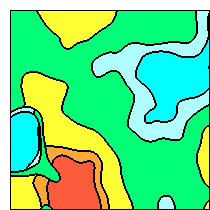
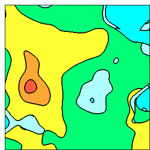
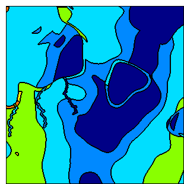
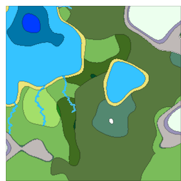
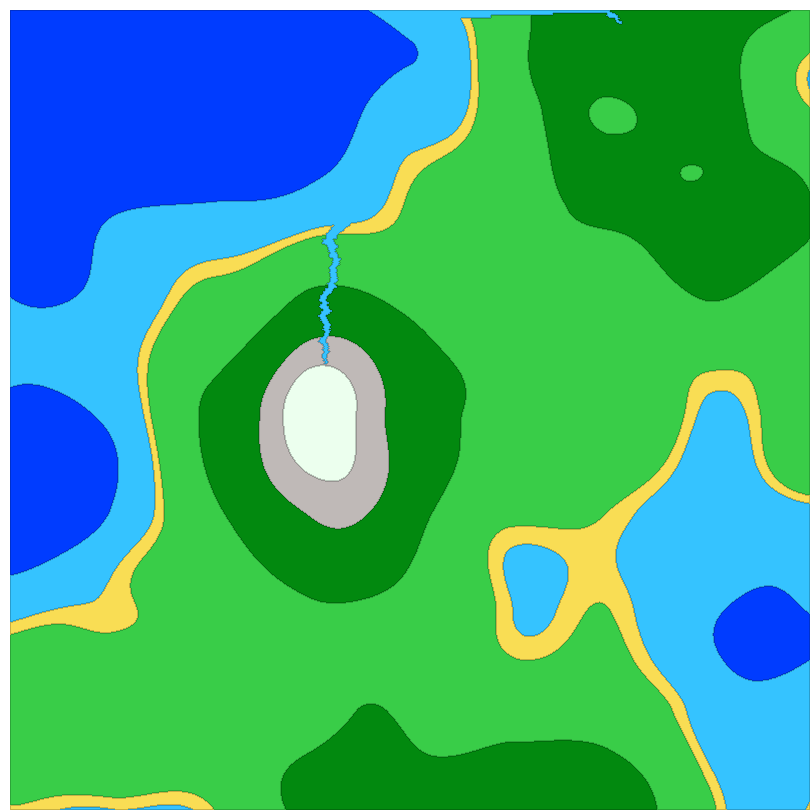

# 2D Map Generator system

## Concept Idea

This system allows you to create, set up and download a procedurally generated 2d map of heights, heat, moisture and biome. This can be useful for making games of RoguelIke, RTS, Survival or RPG genres, or for playing D&D;

## Description of features
- The size and quantity of some objects (castles, rivers, roads) depends on the area of the map
- Rivers widen from source to mouth
- If the road passes through the river, then it becomes a bridge
- Berries (strawberries, blueberries) are generated only in grassland biome
- Ores (iron, coal) are generated only in the mountains biome
- Corals (Pink, Violet) are generated only in the coast biome

## Description of map generation
1. Three maps(Height, Heat and Moisture) are generated using Perlin noise with different seeds
2. Heat and Moisture maps are renewed using Height map(Mountains are cold and humid, and oceans are humid)
3. Using the Whittaker Classification Scheme, a biome map is generated.

## Architecture

This project was created with classic layered architecture. Map Generator MS contains two logical layers: UI Level (Razor
Pages) and Business Logic layer (ASP.NET MVC Web APP). 

## Screenshots

Hight, Heat, Moisture and Biome maps with rivers, castles and particles (ores, berries and corals) from one and the same seed. Images extension are 200x200px and 300x300px.

Hight map with rivers. Image extension is 900x900px.

### Requirements
- NET 6 SDK
- ASP.NET 6
- IDE for C#(.NET). Rider(preferred) or Visual Studio 2019+

## Authors
Kolosov Serhii — [@MrSampy](www.t.me/MrSampy)

## Contributing
If you have any ideas for improving the program, feel free to add new Issues on the [Issues page](https://github.com/MrSampy/Course-work/issues).

You can also create Pull Requests on the [Pull Requests](https://github.com/MrSampy/Course-work/pulls) page.

## License
This program is distributed under an MIT License.

## Future
1. Use Perlin Noise to generate houses in Castles 
2. Add generation of coral reef
3. Add generation different types of mountains
4. Add collapsing the map on both axes
5. Add Spherical map generation
