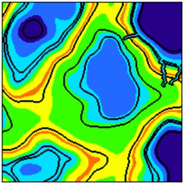

# Map Generator system

## Concept Idea

This system allows you to create a procedurally generated map of heights, heat and humidity. This can be useful for making games of RoguelIke, RTS, Survival or RPG genres, or for playing D&D;

## Architecture

This project was created with classic layered architecture. Map Generator MS contains two logical layers: UI Level (Razor
Pages) and Business Logic layer (ASP.NET MVC Web APP). 

#### Screenshots

## Authors
Kolosov Serhii — [@MrSampy](www.t.me/MrSampy)

## Contributing
If you have any ideas for improving the program, feel free to add new Issues on the [Issues page](https://github.com/MrSampy/Course-work/issues).

You can also create Pull Requests on the [Pull Requests](https://github.com/MrSampy/Course-work/pulls) page.

## License
This program is distributed under an MIT License.

## Future
1. Use Perlin Noise to generate houses in Castles 
2. Add generation of coral reef
3. Add generation different types of mountains
4. Add collapsing the map on both axes
5. Add Spherical map generation
